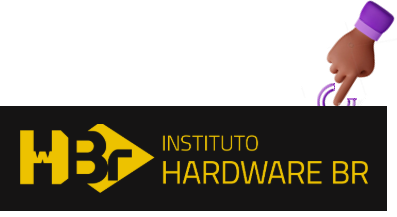
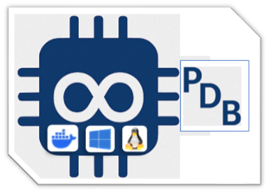

[](https://hardware.org.br/)

# 🚀 EmbarcaTech 2025 - Phase I 

## 📚 Objective
This repository presents the initial Embedded Systems projects developed during EmbarcaTech 2025 - Phase I at HBr Campinas. It includes foundational code, tests, basic documentation, and essential resources that laid the groundwork for the advanced implementations in Phase II.
[EmbarcaTech 2025 - Phase I](https://github.com/alfecjo/antonio_almeida_embarcatech_HBr_2025/tree/main/project000/antonio_almeida_embarcatech_HBr_2025_fase_1)

# 🚀 EmbarcaTech 2025 - Phase II

## 📚 Objective
This repository showcases the **Embedded Systems** projects developed in **EmbarcaTech 2025 - Phase II**. Here, you will find source code, documentation, and resources used in the development of these systems.

## 🔗 Projects
Below is a list of developed projects. Each has its own directory within the repository:

## 🎯 Project Objective
Each project's purpose and specific goals are described in detail inside its own directory.  
To learn more about a project, refer to its individual `README.md` file located within the project's folder.

## 📂 Repository Structure
```
/projects
│── /project000 (Phase I)
│   │── /ssd1306_oled_bdl_final
│       ├── include/             # Headers (.h, .hpp)
│       ├── src/                 # Main source code (.c, .cpp)
│       ├── CMakeLists.txt       # Project configuration
│       └── README.md            # Project Overview
│── /project001 (Phase II)
│   │── /ssd1306_oled_copyright
│       │── assets               # Images, Videos, and Diagrams
│       │── docs                 # Technical Documentation
│       ├── include/             # Headers (.h, .hpp)
│       ├── src/                 # Main source code (.c, .cpp)
│       ├── CMakeLists.txt       # Project configuration
│       └── README.md            # Project Overview
│── /project002
│   │── /ssd1306_oled__plus_plus_copyright
│       │── assets               # Images, Videos, and Diagrams
│       │── docs                 # Technical Documentation
│       ├── include/             # Headers (.h, .hpp)
│       ├── src/                 # Main source code (.c, .cpp)
│       ├── CMakeLists.txt       # Project configuration
│       └── README.md            # Project Overview
│── /project003
│   │── /ssd1306_oled_joy_copyright
│       │── assets               # Images, Videos, and Diagrams
│       │── docs                 # Technical Documentation
│       ├── include/             # Headers (.h, .hpp)
│       ├── src/                 # Main source code (.c, .cpp)
│       ├── CMakeLists.txt       # Project configuration
│       └── README.md            # Project Overview
│── /project004
│   │── /ssd1306_oled_joy_plus_plus_copyright
│       │── assets               # Images, Videos, and Diagrams
│       │── docs                 # Technical Documentation
│       ├── include/             # Headers (.h, .hpp)
│       ├── src/                 # Main source code (.c, .cpp)
│       ├── CMakeLists.txt       # Project configuration
│       └── README.md            # Project Overview
│── /project005
│   │── /ssd1306_oled_temp_int_copyright
│       │── assets               # Images, Videos, and Diagrams
│       │── docs                 # Technical Documentation
│       ├── include/             # Headers (.h, .hpp)
│       ├── src/                 # Main source code (.c, .cpp)
│       ├── CMakeLists.txt       # Configuração do projeto
│       └── README.md            # Project Overview
│── /project006
│   │── /ssd1306_oled_temp_int_plus_plus_copyright
│       │── assets               # Images, Videos, and Diagrams
│       │── docs                 # Technical Documentation
│       ├── include/             # Headers (.h, .hpp)
│       ├── src/                 # Main source code (.c, .cpp)
│       ├── CMakeLists.txt       # Project configuration
│       └── README.md            # Project Overview
│── /project007
│   │── /ssd1306_oled_simulador_galton_board
│       │── assets               # Images, Videos, and Diagrams
│       │── docs                 # Technical Documentation
│       ├── include/             # Headers (.h, .hpp)
│       ├── src/                 # Main source code (.c, .cpp)
│       ├── CMakeLists.txt       # Project configuration
│       └── README.md            # Project Overview
│── /project008
│   │── /ssd1306_oled_simulador_galton_board_plus_plus_copyright
│       │── assets               # Images, Videos, and Diagrams
│       │── docs                 # Technical Documentation
│       ├── include/             # Headers (.h, .hpp)
│       ├── src/                 # Main source code (.c, .cpp)
│       ├── CMakeLists.txt       # Project configuration
│       └── README.md            # Project Overview
│── /project009
│   │── /led_toggle
│       ├── app/
│       │   └── main.c
│       ├── drivers/
│       │   └── led_embutido.c
│       ├── hal/
│       │   └── hal_led.c
│       ├── include/
│       │   ├── led_embutido.h
│       │   └── hal_led.h
│       ├── CMakeLists.txt
│       └── README.md            # Project Overview
│── /project010
│   │── /adc_convert
│       ├── src/
│       │   ├── adc.h
│       │   └── adc_convert.c
│       ├── test/
│       │   └── test_adc.c
│       ├── unity/
│       │   ├── unity.c
│       │   ├── unity.h
│       │   └── unity_internals.h
│       ├── include/
│       │   └── adc.h
│       ├── CMakeLists.txt
│       └── README.md            # Project Overview
│── /project011
│   │── /mqtt
│       │── assets               # Images, Videos, and Diagrams
│       │── docs                 # Technical Documentation
│       ├── include/             # Headers (.h, .hpp)
│       ├── src/                 # Main source code (.c, .cpp)
│       ├── CMakeLists.txt       # Project configuration
│       └── README.md            # Project Overview
│── /project012
│   │── /synthesize_audio_ac
│       │── assets               # Images, Videos, and Diagrams
│       │── docs                 # Technical Documentation
│       ├── include/             # Headers (.h, .hpp)
│       ├── src/                 # Main source code (.c, .cpp)
│       ├── CMakeLists.txt       # Project configuration
│       └── README.md            # Project Overview
│── /project013
│   │── /synthesize_audio_plus_plus__copyright
│       │── assets               # Images, Videos, and Diagrams
│       │── docs                 # Technical Documentation
│       ├── include/             # Headers (.h, .hpp)
│       ├── src/                 # Main source code (.c, .cpp)
│       ├── CMakeLists.txt       # Project configuration
│       └── README.md            # Project Overview
│── /project014
│   │── /bdl_freertos_ac__copyright
│       │── assets               # Images, Videos, and Diagrams
│       │── docs                 # Technical Documentation
│       ├── include/             # Headers (.h, .hpp)
│       ├── src/                 # Main source code (.c, .cpp)
│       ├── CMakeLists.txt       # Project configuration
│       └── README.md            # Project Overview
│── /project015
│   │── /ping_google_bdl_ac__copyright
│       │── assets               # Images, Videos, and Diagrams
│       │── docs                 # Technical Documentation
│       ├── include/             # Headers (.h, .hpp)
│       ├── src/                 # Main source code (.c, .cpp)
│       ├── CMakeLists.txt       # Project configuration
│       └── README.md            # Project Overview
│── README.md  (General repository explanation)
└── LICENSE
```

## 💼 EmbarcaTech 2025 – Modular Projects with Raspberry Pi Pico W...

***A hands-on exploration of embedded systems using sensors, simulations, and graphical displays programmed in C/C++ and tested with [BitDogLab](https://github.com/BitDogLab/BitDogLab) environment.***

---

### 📦 Project 000 — Initial Phase  
[](https://github.com/alfecjo/antonio_almeida_embarcatech_HBr_2025/tree/main/project000/antonio_almeida_embarcatech_HBr_2025_fase_1)

---

### 📘 Project 001 — Basic OLED Display  
[](./project001/ssd1306_oled_copyright/)

### 📘 Project 002 — OLED Plus Plus  
[](./project002/ssd1306_oled__plus_plus_copyright/)

---

### 🎮 Project 003 — OLED with Joystick  
[](./project003/ssd1306_oled_joy_copyright/)

### 🎮 Project 004 — OLED Joystick Plus Plus  
[](./project004/ssd1306_oled_joy_plus_plus_copyright/)

---

### 🌡️ Project 005 — Internal Temperature on OLED  
[](./project005/ssd1306_oled_temp_int_copyright/)

### 🌡️ Project 006 — Temp. Internal Plus Plus  
[](./project006/ssd1306_oled_temp_int_plus_plus_copyright/)

---

### 🎲 Project 007 — Galton Board Simulator  
[](./project007/ssd1306_oled_simulador_galton_board_copyright/)

### 🎲 Project 008 — Galton Board Plus Plus  
[](./project008/ssd1306_oled_simulador_galton_board_plus_plus_copyright/)

---

### 🎇 Project 009 — Led Toggle  
[](./project009/led_toggle)

---

### 🌡️ Project 010 — ADC Temperature Conversion with Unity Test  
[](./project010/adc_convert/)

---

### 🤖 Project 011 — MQTT reads the chip temperature via I2C and publishes it to a Broker, which receives the information and makes it available to subscribers 
[](./project011/mqtt/)

---

### 🎙️ Project 012 — BitDogLab Audio Recorder – C Version  
[](./project012/synthesize_audio_ac/)

### 🎙️ Project 013 — BitDogLab Audio Recorder – C++ Version
[](./project013/synthesize_audio_plus_plus__copyright/)

---

### 🏋️‍♀️ Project 014 — BitDogLab starting FreeRTOS
[](./project014/bdl_freertos_ac/)

---

### 👑 Project 015 — BitDogLab pinging Google server (FreeRTOS)
[](./project015/ping_google_bdl_ac/)

---

## 🛠️ Requirements and Setup
To compile and run the projects on the **Raspberry Pi Pico W** - [BitDogLab](https://github.com/BitDogLab/BitDogLab) environment, follow these steps:

1. **Install the Pico SDK** following the official Raspberry Pi instructions.

2. Clone this repository:
   ```bash
   git clone https://github.com/alfecjo/antonio_almeida_embarcatech_HBr_2025.git
   cd antonio_almeida_embarcatech_HBr_2025/project001/ssd1306_oled_copyright
   ```

3. **Create the build directory and compile:**
   ```bash
   mkdir build
   cd build
   cmake ..
   make
   ```

4. **Upload the firmware to the Raspberry Pi Pico W.**

## 🔌 Uploading Firmware to the Raspberry Pi Pico W

1. **Connect** your Raspberry Pi Pico W to your computer via USB while holding down the **BOOTSEL** button.
2. The device will mount as a USB mass storage device (usually named `RPI-RP2`).
3. **Copy** the compiled `.uf2` firmware file to the mounted drive.
4. Once the transfer is complete, the Pico W will automatically reboot and begin running the new firmware.

> 💡 **Tip:** This firmware is part of the current project and can eventually be tested or integrated with the [BitDogLab](https://github.com/BitDogLab/BitDogLab) environment as needed.

---

## 🐳 Run, Maintain and Deploy the Application in a Docker Containerized Environment

***Tired of manual setups and toolchain installations? Want to skip the setup and run the projects in a ready-to-use development environment?***

🚀 **Launch all projects using our custom Docker image with full Pico SDK support!**  
The image includes build tools, dependencies, and sample projects — all pre-configured.

📈 **Visit the repository and get started now:**                         👇

<p align="center">
  <a href="https://github.com/alfecjo/rp2040-container">
    
  </a>
</p>

   - 💡 Use this container to compile, test, and develop your Raspberry Pi Pico and [BitDogLab](https://github.com/BitDogLab/BitDogLab) projects instantly — no manual installations needed!
   - 🛠️ Created and maintained by the author of this project to simplify and accelerate development.

---

## 👤 Author
**[Antonio Almeida](https://alfecjo.github.io/) Embedded Systems Student**

[](https://hardware.org.br/servicos/)

Have suggestions or found a bug?
Feel free to contribute or open an [issue](https://github.com/alfecjo/antonio_almeida_embarcatech_HBr_2025/issues). 🚀

---

- ## Return
  [](https://github.com/alfecjo)
