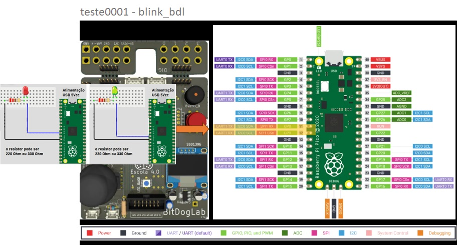
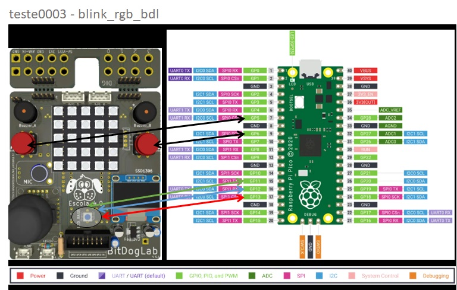
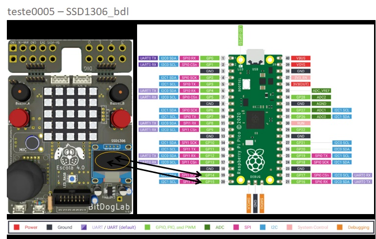
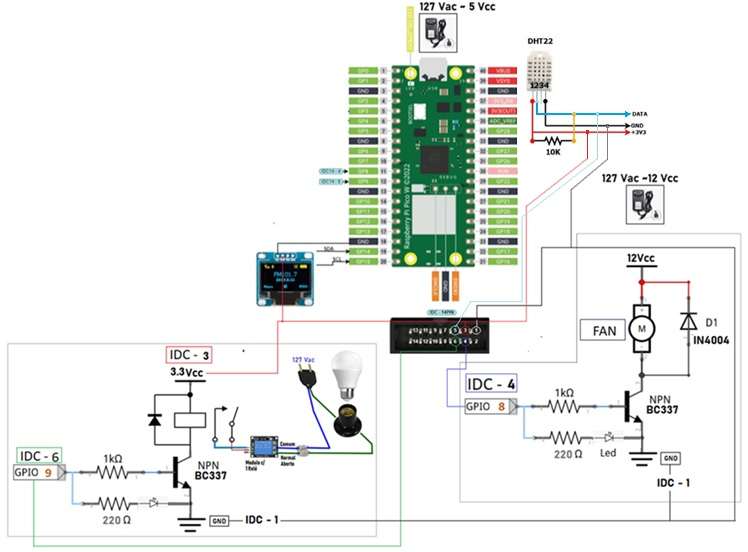

# 🚀 EmbarcaTech 2025 - Phase I 

## 📚 Objective
This repository presents the initial Embedded Systems projects developed during EmbarcaTech 2025 - Phase I at HBr Campinas. It includes foundational code, tests, basic documentation, and essential resources that laid the groundwork for the advanced implementations in Phase II.

---

## ⚠️ Important Note:
You may need to adjust the `CMakeLists.txt` file according to your development environment, as each setup might differ based on the developer's system configuration. Without these adjustments, the code may not behave as expected.

---

### 📌 Description

- This initial test consists of blinking an LED using the Raspberry Pi Pico. It simulates the use of GPIOs that will activate LED_PIN_LIGHT (a heat-generating light source) and LED_PIN_FAN (a fan that removes hot air from the environment).
- The code was developed in C/C++ and tested in the Bitdoglab environment.

### 📝 Document the dependencies and environment configurations.

Complete C code: blink_bdl.c
CMake file: CMakeLists.txt

### 🔧 Status

🚧 Tested

___

### 📌 Description

- His initial test consists of using Button A and Button B to activate the RGB LED when pressed, using the Raspberry Pi Pico.
- The code was developed in C/C++ and tested in the Bitdoglab environment.

### 📝 Document the dependencies and environment configurations.

Complete C code: button_buzzer_bdl.c
CMake file: Cmakefiles.txt 

### 🔧 Status

🚧 Tested

___

### 📌 Description

- His initial test consists of using Button A and Button B to activate the RGB LED when pressed, using the Raspberry Pi Pico.
- The code was developed in C/C++ and tested in the Bitdoglab environment.

### 📝 Document the dependencies and environment configurations.

Complete C code: blink_rgb_bdl.c
CMake file: Cmakefiles.txt 

### 🔧 Status

🚧 Tested

___

### 📌 Description

- His initial test consists of using Button A and Button B to activate the RGB LED when pressed, using the Raspberry Pi Pico.
- The code was developed in C/C++ and tested in the Bitdoglab environment.

### 📝 Document the dependencies and environment configurations.

Complete C code: buzzer_bdl.c
CMake file: Cmakefiles.txt 

### 🔧 Status

🚧 Tested

___
### 🚀 Adicionando teste0005 Bitdoglab - ssd1306_bdl

### 📌 Description

- His initial test consists of using Button A and Button B to activate the RGB LED when pressed, using the Raspberry Pi Pico.
- The code was developed in C/C++ and tested in the Bitdoglab environment.

### 📝 Document the dependencies and environment configurations.

Complete C code: ssd1306_bdl.c
CMake file: Cmakefiles.txt 

### 🔧 Status

🚧 Tested

___
### 🚀 Adicionando teste0006 Bitdoglab - dh22_bdl

### 📌 Description

- His initial test consists of using Button A and Button B to activate the RGB LED when pressed, using the Raspberry Pi Pico.
- The code was developed in C/C++ and tested in the Bitdoglab environment.

- The code structure allows for efficient interchangeability, demonstrating how the separation of responsibilities between functionalities enables parts of the system to be reused in different solutions. In this way, the chassis itself can serve as a foundation for new applications, even if they have completely different functionalities.

- Key benefits of this approach
    ✔ Code reuse – Reduces rework and improves efficiency.
    ✔ Faster development – Solutions can be built quickly.
    ✔ Cost reduction – Less time and effort required.
    ✔ Quality assurance – Code already tested and validated.

- This strategy not only optimizes development but also makes systems more modular, scalable, and sustainable in the long run. 🚀

- This application could easily serve as the main project for the final delivery...

- The code was developed in C/C++ and tested in the Bitdoglab environment.

### 📝 Document the dependencies and environment configurations.

Complete C code: dht22_bdl.c
CMake file: Cmakefiles.txt 

### 🔧 Status

🚧 Tested

___

### 📌 Description

- His initial test consists of using Button A and Button B to activate the RGB LED when pressed, using the Raspberry Pi Pico.
- The code was developed in C/C++ and tested in the Bitdoglab environment.

### 📝 Document the dependencies and environment configurations.

Complete C code: goertzel_bdl.c
CMake file: Cmakefiles.txt 

### 🔧 Status

🚧 Tested
___
### 📋 List of tests  
✔ **🟢 Test 0001 - blink_bdl**  
✔ **🟢 Test 0002 - button_buzzer_bdl**  
✔ **🟢 Test 0003 - blink_rgb_bdl**  
✔ **🟢 Test 0004 - buzzer_bdl**  
✔ **🟢 Test 0005 - ssd1306_bdl**  
✔ **🟢 Test 0006 - dht22_bdl**  
✔ **🟢 Test 0007 - goertzel_bdl**  

---

## 🐳 Run, Maintain and Deploy the Application in a Docker Containerized Environment

***Tired of manual setups and toolchain installations? Want to skip the setup and run the projects in a ready-to-use development environment?***

🚀 **Launch all projects using our custom Docker image with full Pico SDK support!**  
The image includes build tools, dependencies, and sample projects — all pre-configured.

👇 **Visit the repository and get started now:**

  

   - 💡 Use this container to compile, test, and develop your Raspberry Pi Pico and [BitDogLab](https://github.com/BitDogLab/BitDogLab) projects instantly — no manual installations needed!
   - 🛠️ Created and maintained by the author of this project to simplify and accelerate development.

---

## 👤 Author
**[Antonio Almeida](https://alfecjo.github.io/) Embedded Systems Student**

Have suggestions or found a bug?
Feel free to contribute or open an [issue](https://github.com/alfecjo/antonio_almeida_embarcatech_HBr_2025/issues). 🚀

---

- ## Return to the main page
  
