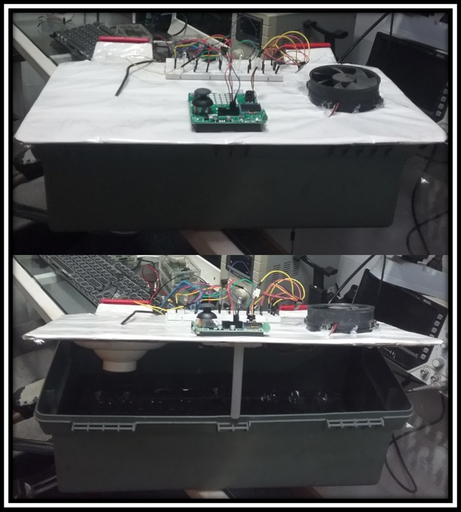

### Observação importante:
Este é o repositório que contém a versão final do projeto: 'Eclo-Piu-Piu'. Pode ser necessário algumas alterações no arquivo CMakeLists.txt, haja visto que cada instalação
do ambiente segue características individuais de cada projetista. Sem essas alterações o
código pode não apresentar o comportamento desejado!

A instalação utilizada para construção desta solução, bem como dos testes segue a lógica a seguir:

```cmake
#Versionamento
cmake_minimum_required(VERSION 3.12)

# Pull in SDK (must be before project)
include(pico_sdk_import.cmake)
include(pico_extras_import_optional.cmake)

#Raiz do projeto
project(pico_examples C CXX ASM)

set(CMAKE_C_STANDARD 11)
set(CMAKE_CXX_STANDARD 17)

if (PICO_SDK_VERSION_STRING VERSION_LESS "2.1.0")
    message(FATAL_ERROR "Raspberry Pi Pico SDK version 2.1.0 (or later) required. Your version is ${PICO_SDK_VERSION_STRING}")
endif()

set(PICO_EXAMPLES_PATH ${PROJECT_SOURCE_DIR})

# If you want debug output from USB (pass -DPICO_STDIO_USB=1) this ensures you don't lose any debug output while USB is set up
if (NOT DEFINED PICO_STDIO_USB_CONNECT_WAIT_TIMEOUT_MS)
    set(PICO_STDIO_USB_CONNECT_WAIT_TIMEOUT_MS 3000)
endif()

# Initialize the SDK
pico_sdk_init()

#Adiciona script customizado
include(example_auto_set_url.cmake)

# Adiciona o executável
add_executable(ssd1306_oled_bdl
    src/ssd1306_oled_bdl.c
    src/ssd1306.c
    src/adc_setup.c
    src/i2c_setup.c
    src/oled_setup.c
    src/temperature.c
)

# Diretórios de inclusão
target_include_directories(ssd1306_oled_bdl
    PUBLIC
    ${CMAKE_CURRENT_SOURCE_DIR}/include
)

# Linka as bibliotecas necessárias
target_link_libraries(ssd1306_oled_bdl pico_stdlib hardware_i2c hardware_adc)

# Habilita USB e desabilita UART
pico_enable_stdio_usb(ssd1306_oled_bdl 1)
pico_enable_stdio_uart(ssd1306_oled_bdl 0)

# Gera arquivos extras (map/bin/hex/uf2)
pico_add_extra_outputs(ssd1306_oled_bdl)

# Adiciona URL do projeto
example_auto_set_url(ssd1306_oled_bdl)

if (TARGET hardware_i2c)
    add_subdirectory_exclude_platforms(ssd1306_oled_bdl)
else()
    message("Skipping I2C examples as hardware_i2c is unavailable on this platform")
endif()
```
___
### 🚀 **Apresentação do projeto.**

📌 O projeto idealiza uma incubadora para ovos, compacta para uso doméstico e pequenos criadores, automatizado que controla a temperatura para garantir um ambiente ideal para a eclosão. O projeto utiliza um Raspberry Pi Pico W – Bitdoglab, para monitoramento e controle da temperatura. Consiste em acionar uma lâmpada resistiva para aquecimento e ventoinha para circulação de ar, consequentemente resfriando o ambiente.
Com capacidade para 36 ovos e medindo: 20cm de altura, 15cm de largura e 45cm de comprimento, a incubadora pode ser aplicada tanto para uso doméstico quanto para pequenas criações comerciais de aves, aumentando a taxa de sucesso na incubação.
Através de um display OLED 128x64, exibi informações de temperatura, aproveitando o sensor que há na placa.
 
Em resumo, manter a temperatura estável de forma automática e permanente dentro dos valores apresentados.
___

### 📝 **O código foi desenvolvido em C/C++ e testado no ambiente Bitdoglab.**

### 🔧 **Status**

 🚧 Testado 🟢
___

### 📋 **Lista de Testes que contribuiram para a criação do projeto:**

🟢 Teste 0001 - blink_bdl
🟢 Teste 0002 - button_buzzer_bdl
🟢 Teste 0003 - blink_rgb_bdl
🟢 Teste 0004 - buzzer_bdl
🟢 Teste 0005 - ssd1306_bdl
🟢 Teste 0006 - goertzel_bdl
___
