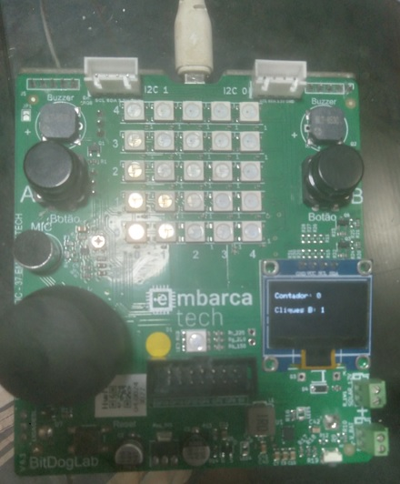

### ⚠️ Important Note:
You may need to adjust the `CMakeLists.txt` file according to your development environment, as each setup might differ based on the developer's system configuration. Without these adjustments, the code may not behave as expected.

---

## 🚀 **Assignment**

## 📌 Countdown Timer with Event Logging via Interrupts

---

## 🛠️ Logic Explanation

## 🎯 Write a program in C that implements a **countdown timer controlled by interrupts**, following this behavior:

1. Every time **Button A (GPIO5)** is pressed:
   1. The countdown resets to **9**, and the value is shown on the **OLED display**.
   2. The system enters **active countdown mode**, decrementing the counter by 1 every second until it reaches 0.
   3. While the countdown is running (from 9 to 0):
      - The system should count how many times **Button B (GPIO6)** is pressed.
      - This number should also be displayed in real time on the OLED.
   4. When the countdown reaches **0**:
      - The system **freezes**.
      - Any additional Button B presses are **ignored** (they are not counted outside the countdown window).
   5. While frozen, the OLED displays:
      - The final countdown value: `0`.
      - The **total number of Button B presses** registered during the 9-second countdown window.
2. To restart the process:
   1. Press **Button A** again.
   2. The countdown is reset to **9**.
   3. The counter for Button B presses is also reset to **0**.
   4. A new countdown cycle begins.

---

## 📝 **The code was written in C/C++ and tested using the Bitdoglab platform.**

---

## 🔧 **Status**

✅ Tested – Working properly 🟢

---

## 📋 **Checklist of Test Cases That Supported Project Development**

- 🟢 Test 001 – Success! Time-based software debounce implemented.

---

## 🖼️ Hardware Setup

