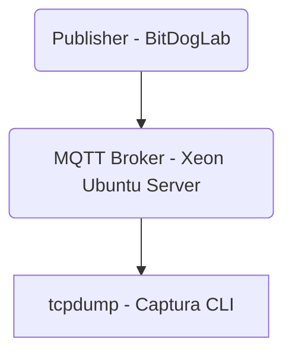

# Projeto: Monitoramento MQTT com BitDogLab, Servidor Xeon (Ubuntu) e Tcpdump

## 📌 Visão Geral

Este projeto demonstra a comunicação via protocolo **MQTT**, utilizando uma placa **BitDogLab** como *Publisher* e um **servidor Xeon com Ubuntu** como *Broker MQTT*. Para a análise do tráfego de rede, é utilizada a ferramenta **tcpdump**, que oferece uma visão detalhada dos pacotes em tempo real com atenção especial a demonstração de pacotes cifrados, bem como certificados tls.

Originalmente idealizado com fins educacionais e experimentais, o projeto evoluiu de um ambiente baseado em *Raspberry Pi* para um servidor mais robusto, refletindo práticas de ambientes reais de produção.

> ⚠️ **Importante:** Sinta-se a vontade para começar quando quiser, contudo, esta aplicação é de nível avançado (*hardcore*), recomendada para desenvolvedores com experiência técnica sólida. Não se trata de uma solução *plug-and-play*.

## 🧱 Componentes da Arquitetura

- **BitDogLab**: atua como cliente MQTT (Publisher), transmitindo dados sensoriais;
- **Servidor Xeon com Ubuntu**: executa o broker MQTT (como Mosquitto), configurado com criptografia TLS;
- **Tcpdump**: utilizado para análise e diagnóstico do tráfego de rede entre os dispositivos;
- **Infraestrutura de Segurança**: geração e gestão de certificados TLS, controle de acesso e configuração de firewall.

## ⚙️ Complexidade Técnica

Cada componente tem um papel crítico, e qualquer erro em:

- configuração do broker,
- certificados TLS (ex: CN inválido),
- portas e regras de firewall mal ajustadas,
- ou na estrutura dos tópicos MQTT

pode comprometer todo o sistema. Isso exige **diagnóstico técnico preciso**, **resiliência** e **atenção aos detalhes**.

---

---

### 🛡️ Para se pensar futuramente:

- WebSocket seguro wss.
- IP filtering no roteador (acesso restrito por IP ou geolocalização)
- Autenticação JWT na interface Angular
- Bucket S3 com acesso privado via CloudFront
- Logs, métricas e alertas de tráfego suspeito

> Com essa arquitetura, você transforma seu laboratório caseiro em uma plataforma IoT global, moderna, segura e escalável — pronta para demonstrações profissionais ou até aplicações comerciais. O céu é o limite!!!

---

## ⚠️ Considerações Finais — Resiliência Técnica antes da Escalabilidade

Este projeto não se enquadra em soluções do tipo *plug-and-play* nem segue um padrão de replicação simples como uma “receita de bolo”. Originalmente no SDK, foi transformado de tal forma a atender as especificações que praticamente virou outra aplicação. Desenvolver uma aplicação em C/C++ sobre um SDK próprio — especialmente quando executada em um ambiente containerizado — utilizando o protocolo MQTT com criptografia TLS, exige conhecimento profundo em diversas camadas da arquitetura.

A aplicação depende de múltiplos componentes interdependentes:

- O dispositivo cliente (BitDogLab);
- Um broker MQTT (Mosquitto) executando em um servidor distinto;
- Uma infraestrutura de segurança baseada em certificados TLS e controle de acesso;
- Configurações de rede, como portas, firewall, e possíveis mapeamentos de DNS dinâmico (DDNS).

Cada etapa envolve detalhes que, se mal configurados, comprometem a operação como um todo. Um certificado inválido, uma ACL restritiva, ou uma porta de rede não liberada podem inviabilizar a comunicação sem dar pistas da origem do problema.

Pensando assim, mais do que habilidades em programação embarcada, esse tipo de projeto exercita:

- **Compreensão sistêmica** de arquitetura de comunicação segura;
- **Capacidade de diagnóstico técnico** frente a falhas silenciosas;
- **Planejamento de implantação**, considerando provisionamento, atualizações e segurança contínua.

Trata-se de um excelente exercício de maturidade técnica, que promove resiliência, atenção aos detalhes e domínio prático de integração entre hardware, protocolos de rede e boas práticas de segurança.

Chegar até aqui e conseguir operar o sistema de forma funcional e segura, demonstra competência em engenharia aplicada.

🎯Isso sim é engenharia real!!!

### 💬 A título de reflexão:
- Em 98% dos casos, os desenvolvedores atuam em soluções já concebidas, mantendo ou expandindo software existente.
- Apenas 2% envolve a criação de novos sistemas — e dentro de um time, essa tarefa normalmente recai sobre o profissional mais experiente.
  - Isso, por si só, já aumenta as chances de sucesso e a cobertura completa dos casos de uso.

> **Próximo desafio:** automatizar o processo de provisionamento, entrega contínua (CI/CD) e gestão escalável de dispositivos. Está pronto, vamos para a AWS?

---

### 📽️ Click e assista ao vídeo no YouTube... 

---

---

## 👤 Author
**[Antonio Almeida](https://alfecjo.github.io/) Embedded Systems Student**

Have suggestions or found a bug?
Feel free to contribute or open an [issue](https://github.com/alfecjo/antonio_almeida_embarcatech_HBr_2025/issues). 🚀

---

- ## Return to the main page
  
