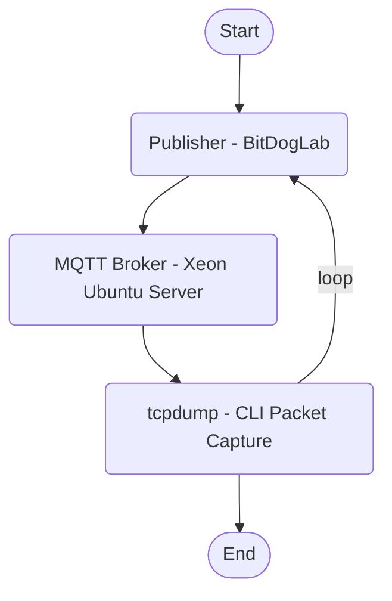

## ⚠️ Important Note:
You may need to adapt your CMakeLists.txt or build system based on your specific development environment. System-specific configurations (e.g., I²C bus, OLED wiring, SDK path) may require manual setup to ensure proper execution.

---

## Project: MQTT Monitoring with BitDogLab, Xeon Server (Ubuntu), and Tcpdump

## 📌 Overview

# MQTT Communication with BitDogLab and Xeon Server

This project demonstrates communication via the MQTT protocol using a **BitDogLab** board as a **Publisher**, and a **powerful Xeon-based Ubuntu server** as the **MQTT Broker**.  
For network traffic analysis, the `tcpdump` tool is employed, providing real-time packet inspection — particularly valuable for showcasing **encrypted traffic** and examining **TLS certificates**.

Originally designed for educational and experimental purposes, the project evolved from a **Raspberry Pi-based setup** to a **robust production-grade server infrastructure**, reflecting real-world engineering practices and deployment standards.

  

> ⚠️ **Note**: Feel free to start whenever you want, but be aware that this is an advanced (hardcore) application — recommended for developers with solid technical experience. This is not a plug-and-play solution.

## 🧱 System Architecture

## ⚙️ Technical Complexity

Each component plays a critical role, and any misconfiguration in:

- the broker settings,
- TLS certificates (e.g., invalid CN),
- port and firewall rules,
- or the structure of MQTT topics

Can compromise the entire system. This demands precise technical diagnostics, resilience, and attention to detail.

---

### 🛡️ For Future Consideration:

- Secure WebSocket (wss)
- IP filtering on the router (IP or geolocation-based access control)
- JWT authentication for the Angular frontend
- Private S3 bucket access via CloudFront
- Logs, metrics, and alerts for suspicious traffic
> With this architecture, you turn your home lab into a modern, secure, and scalable global IoT platform — ready for professional demos or even commercial use. The sky is the limit!

---

## ⚠️ Final Thoughts — Technical Resilience Before Scalability

This project does not fit into plug-and-play solutions or follow a simple “recipe-style” replication pattern. Originally built using an SDK, it was transformed so extensively to meet the specs that it practically became a new application. Developing a C/C++ application over a custom SDK — especially in a containerized environment — using the MQTT protocol with TLS encryption requires deep knowledge across various architectural layers.

The application depends on multiple interdependent components:

- The client device (BitDogLab)
- An MQTT broker (Mosquitto) running on a separate server
- A security infrastructure based on TLS certificates and access control
- Network configurations like ports, firewall rules, and possible dynamic DNS (DDNS) mappings

Each step involves details that, if misconfigured, can break the entire system. An invalid certificate, a restrictive ACL, or a closed port may prevent communication without giving any clue about the root cause.
This kind of project exercises more than just embedded programming skills:

- **System-level** understanding of secure communication architecture
- **Technical diagnostic** capabilities for silent failures
- **Deployment planning**, considering provisioning, updates, and continuous security

This project represents a comprehensive exercise in technical maturity, fostering resilience, precision, and practical expertise in the integration of embedded hardware, network protocols, and cybersecurity principles. Successfully reaching this stage and achieving secure, functional operation of the system is a clear demonstration of applied engineering capability.

🎯Now this is real engineering!

### 💬 Food for Thought:
- In 98% of cases, developers work on already conceived systems, maintaining or expanding existing software.
- Only 2% involves creating entirely new systems — and within a team, this responsibility usually falls to the most experienced engineer.
  - This alone increases the chances of success and ensures full coverage of use cases.

> **Next challenge**: automate provisioning, continuous delivery (CI/CD), and scalable device management. Ready to move to AWS?

---

### 📽️ Video... 

---

## 🐳 Run, Maintain and Deploy the Application in a Docker Containerized EnvironmentRun in a Containerized Environment

Tired of manual setups and toolchain installations? Want to skip the setup and run the projects in a ready-to-use development environment?

🚀 **Launch all projects using our custom Docker image with full Pico SDK support!**  
The image includes build tools, dependencies, and sample projects — all pre-configured.

👇 Visit the repository and get started now:  

  

- 💡 Use this container to compile, test, and develop your Raspberry Pi Pico and [BitDogLab](https://github.com/BitDogLab/BitDogLab) projects instantly — no manual installations needed!
- 🛠️ Created and maintained by the author of this project to simplify and accelerate development.

---

## 👤 Author
**[Antonio Almeida](https://alfecjo.github.io/) Embedded Systems Student**

Have suggestions or found a bug?
Feel free to contribute or open an [issue](https://github.com/alfecjo/antonio_almeida_embarcatech_HBr_2025/issues). 🚀

---

- ## Return to the main page
  
